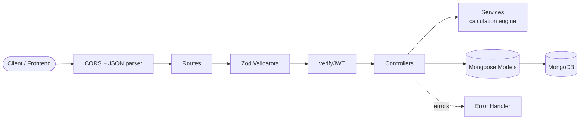

<div align="center">

# 🌍 EnvoSphere — Backend API

**REST API for estimating the environmental footprint of GPU-based AI workloads.**
Calculate energy use, CO₂ emissions, heat output and water consumption — and keep a personal history of every calculation.


</div>

---

## 📑 Table of Contents

- [Overview](#-overview)
- [Features](#-features)
- [Tech Stack](#-tech-stack)
- [Architecture](#-architecture)
- [Project Structure](#-project-structure)
- [Getting Started](#-getting-started)
- [Environment Variables](#-environment-variables)
- [Available Scripts](#-available-scripts)
- [API Reference](#-api-reference)
- [Calculation Methodology](#-calculation-methodology)
- [Data Models](#-data-models)
- [Error Handling](#-error-handling)
- [Security](#-security)
- [Roadmap](#-roadmap)
- [Contributing](#-contributing)
- [License](#-license)

---

## 📖 Overview

The EnvoSphere backend is a **Node.js + Express** service backed by **MongoDB**. Authenticated users submit details about a GPU workload (GPU model, count, hours used, facility efficiency, renewable energy share, etc.). The API computes the environmental impact, **stores the inputs, assumptions and results together**, and lets the user retrieve or delete past calculations.

---

## ✨ Features

- 🔐 **JWT authentication** — register / login with bcrypt-hashed passwords
- 🧮 **Environmental impact engine** — energy, CO₂, heat (kW and BTU/h), water and per-m² intensities
- 💾 **Calculation history** — every result saved with the inputs and assumptions used
- 👤 **Per-user data isolation** — users can only read or delete their own calculations
- ✅ **Schema validation** — request bodies validated with Zod before reaching controllers
- 🧱 **Layered architecture** — routes → validators → controllers → services → models
- 🚨 **Centralised error handling** — consistent JSON error responses via `ApiError` and a global handler
- 🌐 **CORS** — restricted to the configured frontend origin

---

## 🛠 Tech Stack

| Layer          | Technology                                              |
| -------------- | ------------------------------------------------------- |
| Runtime        | Node.js (ES Modules)                                    |
| Framework      | Express 5                                               |
| Database       | MongoDB with Mongoose 9                                 |
| Authentication | JSON Web Tokens (`jsonwebtoken`), `bcrypt`              |
| Validation     | Zod 4                                                   |
| Config         | `dotenv`                                                |
| Dev tooling    | `nodemon`                                               |

---

## 🏗 Architecture



**Request lifecycle:** a request passes through CORS and the JSON body parser, matches a route, is validated (Zod), authenticated (JWT, on protected routes), handled by a controller that delegates business logic to a service, and persists data through a Mongoose model. Any thrown error is forwarded to the global error handler.

---

## 📂 Project Structure

```text
backend/
├── src/
│   ├── config/
│   │   ├── database.js            # MongoDB connection
│   │   └── env.js                 # (reserved) environment config
│   ├── constants/
│   │   ├── gpu.constants.js       # GPU reference data
│   │   └── environmental.constants.js
│   ├── controllers/
│   │   ├── auth.controller.js         # register, login
│   │   ├── calculation.controller.js  # create, list, get, delete
│   │   └── user.controller.js         # (reserved)
│   ├── middlewares/
│   │   ├── auth.middleware.js     # verifyJWT
│   │   ├── error.middleware.js    # global error handler
│   │   ├── validate.middleware.js # reusable Zod validation
│   │   └── notFound.middleware.js # (reserved)
│   ├── models/
│   │   ├── user.model.js
│   │   └── calculation.model.js
│   ├── routes/
│   │   ├── auth.routes.js
│   │   ├── calculation.routes.js
│   │   └── user.routes.js         # (reserved)
│   ├── services/
│   │   ├── calculation.service.js # environmental impact formulas
│   │   ├── ai.service.js          # (reserved)
│   │   ├── auth.service.js        # (reserved)
│   │   └── user.service.js        # (reserved)
│   ├── utils/
│   │   ├── ApiError.js            # custom error class
│   │   └── asyncHandler.js        # async/await error wrapper
│   ├── validators/
│   │   ├── auth.validator.js
│   │   ├── calculation.validator.js
│   │   └── user.validator.js      # (reserved)
│   ├── app.js                     # Express app setup
│   └── server.js                  # entry point
├── tests/
│   ├── unit/
│   └── integration/
├── .env.example
├── .gitignore
└── package.json
```

---

## 🚀 Getting Started

### Prerequisites

- [Node.js](https://nodejs.org/) **v20 or higher**
- [MongoDB](https://www.mongodb.com/) — a local instance or a [MongoDB Atlas](https://www.mongodb.com/atlas) cluster
- npm (bundled with Node.js)

### Installation

```bash
# 1. Clone the repository
git clone https://github.com/<your-username>/EnvoSphere.git
cd EnvoSphere/backend

# 2. Install dependencies
npm install

# 3. Create your environment file
cp .env.example .env
# then fill in the values (see "Environment Variables" below)

# 4. Start the development server
npm run dev
```

The API will be available at `http://localhost:3000` (or the `PORT` you configured).

---

## 🔑 Environment Variables

Create a `.env` file in the `backend/` directory:

```env
# Server
PORT=3000

# Database
MONGO_URI=mongodb://localhost:27017/envosphere

# Auth
JWT_SECRET=replace_with_a_long_random_string

# CORS
FRONTEND_URL=http://localhost:5173
```

| Variable       | Required | Description                                                     |
| -------------- | :------: | --------------------------------------------------------------- |
| `PORT`         |    No    | Port the server listens on. Defaults to `3000`.                 |
| `MONGO_URI`    |  ✅ Yes  | MongoDB connection string.                                      |
| `JWT_SECRET`   |  ✅ Yes  | Secret used to sign and verify JWTs. Use a long random value.   |
| `FRONTEND_URL` |  ✅ Yes  | Allowed CORS origin (your frontend's URL).                      |

> ⚠️ Never commit your `.env` file. It is already listed in `.gitignore`.

Generate a strong secret with:

```bash
node -e "console.log(require('crypto').randomBytes(64).toString('hex'))"
```

---

## 📜 Available Scripts

| Command       | Description                                   |
| ------------- | --------------------------------------------- |
| `npm run dev` | Start the server with auto-reload (nodemon)   |
| `npm start`   | Start the server in production mode          |
| `npm test`    | Run the test suite *(not configured yet)*     |

---

## 📡 API Reference

**Base URL:** `http://localhost:3000/api/v1`

Protected routes require the header:

```http
Authorization: Bearer <your_jwt_token>
```

### Endpoint summary

| Method   | Endpoint                  | Auth | Description                               |
| -------- | ------------------------- | :--: | ----------------------------------------- |
| `POST`   | `/auth/register`          |  ❌  | Create a new user account                 |
| `POST`   | `/auth/login`             |  ❌  | Log in and receive a JWT (valid for 1 day) |
| `POST`   | `/calculation/create`     |  ✅  | Run and save an environmental calculation |
| `GET`    | `/calculation/getall`     |  ✅  | List all of the user's calculations       |
| `GET`    | `/calculation/get/:id`    |  ✅  | Get a single calculation by ID            |
| `DELETE` | `/calculation/delete/:id` |  ✅  | Delete a calculation by ID                |

---

### 🔐 Authentication

#### `POST /auth/register`

Create a new account.

**Request body**

```json
{
  "username": "eco_dev",
  "email": "eco@example.com",
  "password": "StrongPass123"
}
```

| Field      | Rules                                                          |
| ---------- | -------------------------------------------------------------- |
| `username` | 3–15 characters; letters, numbers and underscores only         |
| `email`    | Valid email (stored in lowercase)                              |
| `password` | 8–72 characters                                                |

**Response — `201 Created`**

```json
{
  "success": true,
  "message": "User registered successfully",
  "user": {
    "_id": "665f1c2e9b1d4a0012ab34cd",
    "username": "eco_dev",
    "email": "eco@example.com",
    "role": "user",
    "isActive": true,
    "createdAt": "2026-10-10T08:30:00.000Z",
    "updatedAt": "2026-10-10T08:30:00.000Z"
  }
}
```

**Errors:** `400` validation failed · `409` user already exists

---

#### `POST /auth/login`

**Request body**

```json
{
  "email": "eco@example.com",
  "password": "StrongPass123"
}
```

**Response — `200 OK`**

```json
{
  "success": true,
  "message": "Login successful",
  "token": "<jwt>",
  "id": "665f1c2e9b1d4a0012ab34cd"
}
```

**Errors:** `401` invalid email or password

---

### 🧮 Calculations

#### `POST /calculation/create` 🔒

Calculates the environmental impact and saves it to the user's history.

**Request body**

```json
{
  "facilityArea": 120,
  "gpuModel": "NVIDIA H100",
  "gpuCount": 8,
  "hoursUsed": 72,
  "renewableEnergyPercent": 30,
  "pue": 1.4,
  "wue": 1.8
}
```

| Field                    | Type    | Rules                                      |
| ------------------------ | ------- | ------------------------------------------ |
| `facilityArea`           | number  | > 0 (m²)                                   |
| `gpuModel`               | string  | Must be one of the [supported GPUs](#supported-gpu-models) |
| `gpuCount`               | integer | > 0                                        |
| `hoursUsed`              | number  | > 0                                        |
| `renewableEnergyPercent` | number  | 0–100                                      |
| `pue`                    | number  | ≥ 1 (Power Usage Effectiveness)            |
| `wue`                    | number  | ≥ 0 (Water Usage Effectiveness, L/kWh)     |

**Response — `201 Created`**

```json
{
  "success": true,
  "message": "Environmental impact calculated and saved successfully",
  "data": {
    "_id": "6660a1f29b1d4a0012ab9999",
    "user": "665f1c2e9b1d4a0012ab34cd",
    "inputs": { "...": "as submitted" },
    "assumptions": {
      "gpuTdpWatts": 700,
      "carbonIntensityKgPerKwh": 0.72
    },
    "results": {
      "gpuPowerWatts": 5600,
      "gpuPowerKw": 5.6,
      "itEnergyKwh": 403.2,
      "facilityEnergyKwh": 564.48,
      "renewableEnergyKwh": 169.344,
      "gridEnergyKwh": 395.136,
      "co2EmissionsKg": 284.4979,
      "heatKw": 5.6,
      "heatBtuPerHour": 19107.9952,
      "waterConsumptionLitres": 725.76,
      "energyIntensityKwhPerM2": 4.704,
      "carbonIntensityKgPerM2": 2.3708
    },
    "createdAt": "2026-10-10T08:35:00.000Z",
    "updatedAt": "2026-10-10T08:35:00.000Z"
  }
}
```

**Errors:** `400` validation failed · `401` missing / invalid / expired token

---

#### `GET /calculation/getall` 🔒

Returns all calculations for the authenticated user, newest first.

```json
{
  "success": true,
  "count": 2,
  "data": [ { "...": "calculation" }, { "...": "calculation" } ]
}
```

---

#### `GET /calculation/get/:id` 🔒

Returns a single calculation owned by the authenticated user.

**Errors:** `404` calculation not found

---

#### `DELETE /calculation/delete/:id` 🔒

Deletes a calculation owned by the authenticated user.

```json
{
  "success": true,
  "message": "Calculation deleted successfully"
}
```

**Errors:** `404` calculation not found

---

### 🧪 Quick test with cURL

```bash
# Register
curl -X POST http://localhost:3000/api/v1/auth/register \
  -H "Content-Type: application/json" \
  -d '{"username":"eco_dev","email":"eco@example.com","password":"StrongPass123"}'

# Login (copy the token from the response)
curl -X POST http://localhost:3000/api/v1/auth/login \
  -H "Content-Type: application/json" \
  -d '{"email":"eco@example.com","password":"StrongPass123"}'

# Create a calculation
curl -X POST http://localhost:3000/api/v1/calculation/create \
  -H "Content-Type: application/json" \
  -H "Authorization: Bearer <token>" \
  -d '{"facilityArea":120,"gpuModel":"NVIDIA H100","gpuCount":8,"hoursUsed":72,"renewableEnergyPercent":30,"pue":1.4,"wue":1.8}'
```

---

## 🧬 Calculation Methodology

All formulas live in [`src/services/calculation.service.js`](src/services/calculation.service.js).

| Metric                | Formula                                              |
| --------------------- | ---------------------------------------------------- |
| GPU power (W)         | `TDP × gpuCount`                                     |
| GPU power (kW)        | `GPU power (W) / 1000`                               |
| IT energy (kWh)       | `GPU power (kW) × hoursUsed`                         |
| Facility energy (kWh) | `IT energy × PUE`                                    |
| Renewable energy      | `Facility energy × (renewable % / 100)`              |
| Grid energy           | `Facility energy − Renewable energy`                 |
| CO₂ emissions (kg)    | `Grid energy × carbon intensity`                     |
| Heat output (kW)      | `GPU power (kW)`                                     |
| Heat output (BTU/h)   | `GPU power (kW) × 3412.142`                          |
| Water use (litres)    | `IT energy × WUE`                                    |
| Energy intensity      | `Facility energy / facilityArea` (kWh/m²)            |
| Carbon intensity      | `CO₂ emissions / facilityArea` (kg/m²)               |

### Assumptions

- **Grid carbon intensity:** `0.72 kg CO₂ / kWh`
- **GPU power draw:** the GPU's rated TDP at full utilisation

### Supported GPU models

| `gpuModel`            | TDP (W) |
| --------------------- | ------: |
| `NVIDIA H100`         |     700 |
| `NVIDIA A100`         |     400 |
| `NVIDIA L40S`         |     350 |
| `NVIDIA RTX 6000 Ada` |     300 |
| `NVIDIA T4`           |      70 |

> These are estimates intended for comparison and awareness, not certified emissions reporting.

---

## 🗄 Data Models

### User

| Field          | Type    | Notes                                  |
| -------------- | ------- | -------------------------------------- |
| `username`     | String  | Unique, trimmed, 3–30 chars            |
| `email`        | String  | Unique, lowercase, indexed             |
| `passwordHash` | String  | bcrypt hash (never returned by the API) |
| `role`         | String  | `user` (default) or `admin`            |
| `isActive`     | Boolean | Defaults to `true`                     |
| `createdAt` / `updatedAt` | Date | Added automatically         |

### Calculation

| Field         | Type     | Notes                                              |
| ------------- | -------- | -------------------------------------------------- |
| `user`        | ObjectId | Reference to `User` (indexed)                      |
| `inputs`      | Object   | The values submitted by the user                   |
| `assumptions` | Object   | TDP and carbon intensity used for the calculation  |
| `results`     | Object   | All computed metrics                               |
| `createdAt` / `updatedAt` | Date | Added automatically            |

---

## 🚨 Error Handling

All errors are returned in a consistent JSON shape:

```json
{
  "success": false,
  "message": "Human-readable error message",
  "errors": []
}
```

Validation errors use status `400` and include field-level details in `errors`.

| Status | Meaning                                  |
| :----: | ---------------------------------------- |
| `400`  | Validation failed / missing inputs       |
| `401`  | Missing, invalid or expired token        |
| `404`  | Resource not found                       |
| `409`  | Conflict (e.g. user already exists)      |
| `500`  | Unexpected server error                  |

Internally, controllers throw `ApiError(statusCode, message)` and are wrapped with `asyncHandler`, so every failure reaches the global error middleware.

---

## 🔒 Security

- Passwords are hashed with **bcrypt** (10 salt rounds) — plain-text passwords are never stored
- **JWT** access tokens expire after **1 day**
- Request bodies are validated and sanitised with **Zod** before processing
- Calculations are always queried by both `_id` **and** `user`, preventing access to other users' data
- **CORS** is restricted to `FRONTEND_URL`
- Secrets are loaded from environment variables and excluded from version control

---

## 🗺 Roadmap

- [ ] Automated unit and integration tests (`tests/`)
- [ ] AI-generated analysis of calculation results (`ai.service.js`)
- [ ] User profile endpoints (`user.routes.js`)
- [ ] 404 handler middleware
- [ ] Rate limiting and security headers (`express-rate-limit`, `helmet`)
- [ ] Request logging (`morgan` / `pino`)
- [ ] API documentation with Swagger / OpenAPI
- [ ] Health-check endpoint
- [ ] Docker and CI/CD setup

---

## 🤝 Contributing

Contributions are welcome!

1. Fork the repository
2. Create a feature branch: `git checkout -b feature/your-feature`
3. Commit your changes: `git commit -m "feat: add your feature"`
4. Push the branch: `git push origin feature/your-feature`
5. Open a Pull Request

Please keep the existing layered structure (routes → validators → controllers → services → models) and follow the current code style.

---

## 📄 License

Distributed under the **ISC License**.